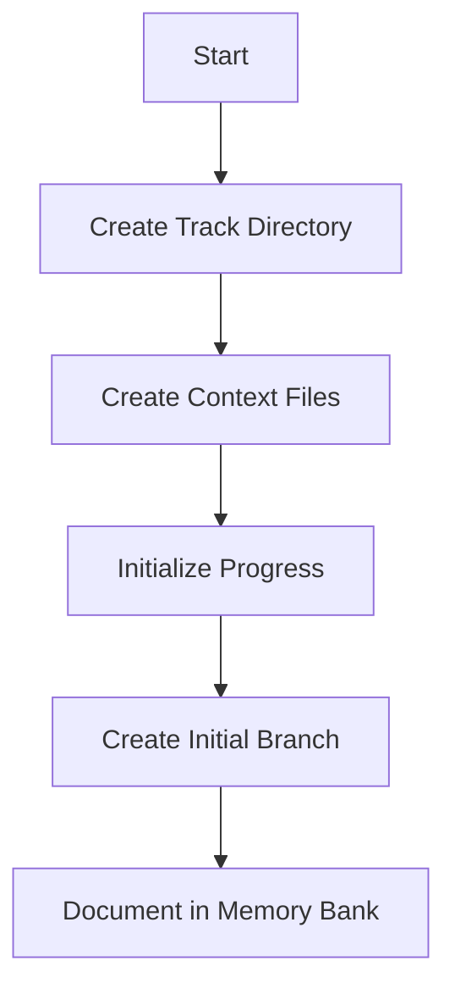
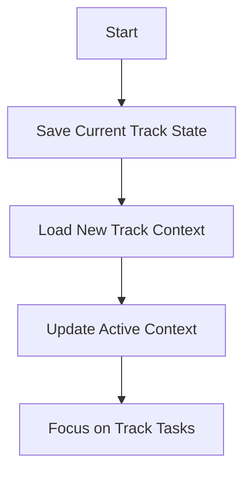

# Track Management

Tracks are conceptual workstreams representing distinct functional areas that persist over time and may span multiple Git branches.

## Track Initialization



When initializing a new track with **$track init <name>**:

1. Create track directory structure
2. Create initial context files
3. Initialize progress tracking
4. Create an initial Git branch for the track
5. Document the track in the main memory bank

## Track Switching



When switching tracks with **$track <name>**:

1. Save the current track's state
2. Load the new track's context
3. Update active-context.md to reflect the track focus
4. Focus on the track's specific tasks

## Track Status

When checking track status with **$track status**:

1. Review all track progress files
2. Identify dependencies between tracks
3. Summarize the status of each track
4. Highlight any conflicts or blockers

## Git Branch Management

### Branch Naming Convention

Git branches should follow the naming convention:
```
<track>-<branch-name>
```

For example:
- `frontend-add-login-form`
- `api-implement-auth`
- `database-create-schema`

This convention helps identify which track a branch belongs to and makes it easier to manage branches across tracks.

### Branch Creation

When creating a new branch with **$branch create <name>**:

1. Ensure the branch name follows the track naming convention
2. Create the branch from the current HEAD
3. Document the branch purpose in the track's context
4. Update the track's progress to reflect the new work

### Branch Updates

When updating a Git branch with **$branch update**:

1. Update the feature Git branch with the latest from main
2. Resolve any conflicts
3. Document the update in the track's context
4. Update the track's progress

### Branch Merging

When a branch is ready to be merged:

1. Signal readiness with **$branch ready <name>**
2. The Orchestrator reviews the branch
3. The Orchestrator merges the branch with **$branch merge <name>**
4. The track's progress is updated to reflect the completed work

### Branch Listing

When listing branches with **$branch list**:

- The Orchestrator sees all branches grouped by track
- Specialists see only branches for their track
